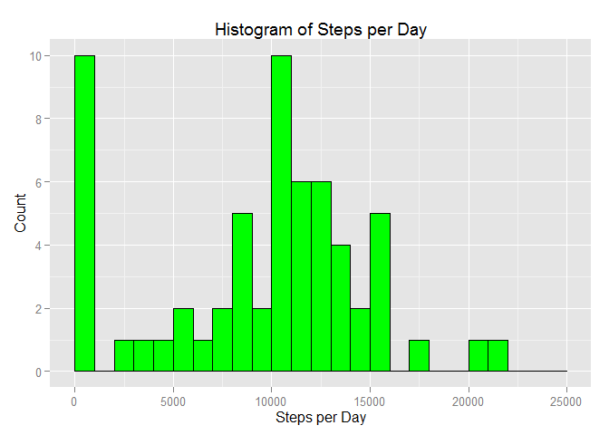
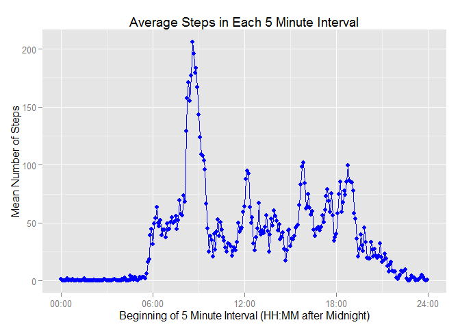
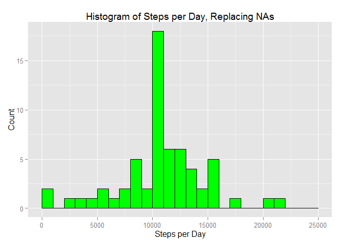
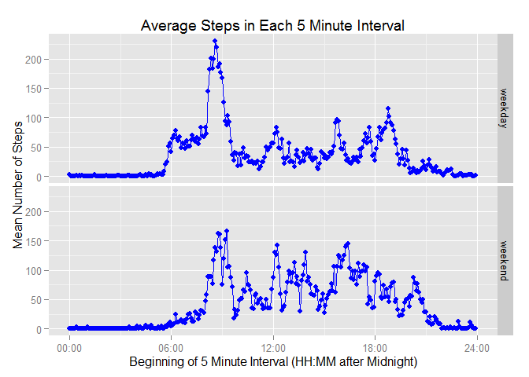

# Reproducible Research: Peer Assessment 1


## Loading and preprocessing the data

Load 3 libraries, and suppress the warnings.

```r
library(ggplot2)
library(lubridate)
suppressWarnings(suppressMessages(library(dplyr)))
```
Unzip the file and read it in. Prcoess the date string using lubridate, and treat the intervals as strings representing the times after midnight. Add ":" for clarity.

```r
unzip("activity.zip")
activity <- read.csv("activity.csv", stringsAsFactors=F)
activity <- activity %>%
                mutate(date = ymd(date)) %>%
                mutate(interval = sprintf("%04d",interval)) %>%
                mutate(interval = gsub("(\\d\\d)(\\d\\d)", "\\1:\\2", interval)) %>%
                mutate(interval = as.factor(interval))
```


## What is mean total number of steps taken per day?

Sum the steps, grouped by date, ignoring NAs. Plot a histogram.

```r
byDate <- activity %>%
                group_by(date) %>% 
                summarize(totalSteps = sum(steps, na.rm=T))

ggplot(data=byDate, aes(totalSteps)) +
    geom_histogram(breaks = seq(0,25000,by=1000), 
    fill="green", col="black") +
    labs(title="Histogram of Steps per Day") +
    labs(x="Steps per Day", y="Count") + 
    scale_y_continuous(limits=c(0,10), breaks=seq(0,10,by=2))
```

 
There is a peak at 0 steps, due to the large number of NA rows. Data over the rest of the days is spread out, with results ranging from a couple thousand to over 20,000, with a peak around 10,000.

Report the mean number of steps per day

```r
mean(byDate$totalSteps)
```

```
## [1] 9354.23
```
Report the median number of steps per day

```r
median(byDate$totalSteps)
```

```
## [1] 10395
```


## What is the average daily activity pattern?

Take an average of the steps, grouped by time interval, ignoring NAs. Plot the time series. Plot shows "HH:MM" to represent hours and minutes after midnight.

```r
byTime <- activity %>%
                group_by(interval) %>%
                summarize(meanSteps = mean(steps, na.rm=T))

ggplot(data=byTime, aes(as.integer(interval), meanSteps)) +
    geom_point(col="blue") +
    geom_line(col="blue") +
    labs(title="Average Steps in Each 5 Minute Interval") +
    labs(x="Beginning of 5 Minute Interval (HH:MM after Midnight)", y="Mean Number of Steps") + 
    scale_x_continuous(limits=c(1,289), breaks=seq(1,289,by=12*6), labels=c(as.character(byTime$interval)[seq(1,288,by=12*6)],"24:00"))
```

 
Report the 5 minute interval with the highest average number of steps.

```r
arrange(byTime,desc(meanSteps))[1,]
```

```
## Source: local data frame [1 x 2]
## 
##   interval meanSteps
## 1    08:35  206.1698
```
This individual is most active around 8:35am.


## Imputing missing values

Many rows are missing data, with NA in the place of the number of steps. This typically happens on entire days, with all intervals missing the recordings. In this section, I have replaced the NAs in the data set with averages from the rest of the data. In specific, I have found the mean over each time interval during the day, and used those means if I found a matching time interval without data. Thus, if there was data missing on a certain day at 7:15am, I found the average at 7:15am on all days with data, and used that as the replacement.

Number of rows missing data:

```r
sum(!complete.cases(activity))
```

```
## [1] 2304
```
Replace the missing data with averages at that same time interval, then group by date to plot a histogram of the sums.

```r
activityNoNA <- activity %>%
    group_by(interval) %>%
    mutate(steps = ifelse(is.na(steps), mean(steps, na.rm=T), steps)) %>%
    ungroup()

byDateNoNA <- activityNoNA %>%
    group_by(date) %>% 
    summarize(totalSteps = sum(steps))

ggplot(data=byDateNoNA, aes(totalSteps)) +
    geom_histogram(breaks = seq(0,25000,by=1000), 
                   fill="green", col="black") +
    labs(title="Histogram of Steps per Day, Replacing NAs") +
    labs(x="Steps per Day", y="Count")
```

 
Now that the NAs have been removed, there is no longer a spike at 0. It has been replaced by a much larger spike above 10,000, which is where the days with NA values ended up.

Report the new mean.

```r
mean(byDateNoNA$totalSteps)
```

```
## [1] 10766.19
```
Report the new median.

```r
median(byDateNoNA$totalSteps)
```

```
## [1] 10766.19
```
These numbers are larger than the earlier averages because 0s have been replaced by much larger numbers. The new mean and median are the same because of the way we are averaging across time intervals, and because we were missing full days of data at a time. Each received a consistent pattern of imputed steps throughout the day, and the daily sums were the same (10766.19).


## Are there differences in activity patterns between weekdays and weekends?

Create an additional factor variable indicating if a day is a weekday or weekend. Group the data by the interval and by this new variable, then compute the mean of the steps. This can allow us to make new time series plots to compare movement patterns at different times of the week.

```r
byTimeWeekInfo <- activityNoNA %>%
    mutate(dayType = as.factor(ifelse(!(weekdays(date) %in% c("Saturday","Sunday")),"weekday","weekend"))) %>%
    group_by(interval, dayType) %>%
    summarize(meanSteps = mean(steps))

ggplot(data=byTimeWeekInfo, aes(as.integer(interval), meanSteps)) +
    geom_point(col="blue") +
    geom_line(col="blue") +
    facet_grid(dayType ~ .) +
    labs(title="Average Steps in Each 5 Minute Interval") +
    labs(x="Beginning of 5 Minute Interval (HH:MM after Midnight)", y="Mean Number of Steps") + 
    scale_x_continuous(limits=c(1,289), breaks=seq(1,289,by=12*6), labels=c(as.character(byTime$interval)[seq(1,288,by=12*6)],"24:00"))
```

 
There are a few noticeably different patterns between weekdays and weekends. For example, this individual wakes up earlier on the weekdays (a little before 6:00am) than the weekends (generally closer to 8:00am). There is a larger spike on weekday mornings, likely corresponding to getting ready in the morning and/or traveling to work. The individual moves less on average during the mid-day on weekdays than weekends. This person is also more active in the late evening on weekends than weekdays.
